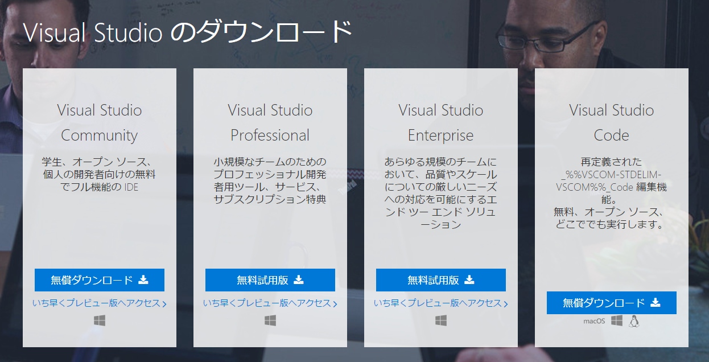
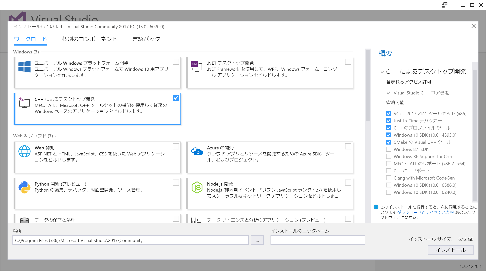

# C++ プログラミングに必要なツールの準備

## Windows の場合
Windows 7 や Windows 8.1, Windows 10 のパソコンで C++ プログラミングをする場合は「Visual Studio Community 2017 (ビジュアル・スタジオ コミュニティ2017)」を使います。

### 1. Visual Studio インストーラーをダウンロードする
https://www.visualstudio.com/downloads/ へアクセスして、Visual Studio のダウンロードページを開きます。Visual Studio にはいくつかのバージョンや関連ツールがありますが、初めての C++ プログラミングには「Visual Studio Community 2017」が最適です。選択肢から「Visual Studio Community 2017」を選択し、インストールのためのファイル（インストーラー）をダウンロードします。

 
 ### 2. Visual Studio インストーラーを実行して C++ 開発ツールをインストールする
ダウンロードしたインストーラーを実行すると、プログラミング言語や開発ツールを選択する次のような画面が出てきます。

 
今回は C++ プログラミングに必要なツールだけをインストールします。「C++ によるデスクトップ開発」を選択して右下の「インストール」を押せば、C++ プログラミングに必要なツールのインストールが始まります。インストールする項目はあとで追加や変更ができるので、もしほかのプログラミング言語やツールに興味を持つかもしれないときも安心してください。

インターネットの速度によっては、インストールに時間がかかる場合があります。次のような画面が出てきたらインストールは完了です。パソコンの再起動を求められることがあるので、その場合は従いましょう。

## macOS の場合
MacBook や iMac など macOS のパソコンで C++ プログラミングをする場合は「Xcode (エックスコード)」を使います。あなたのパソコンが macOS の場合は「macOS で C++ プログラミングをはじめる」へ進んでください。

### 1. Xcode をインストールする
まず、C++ プログラミングのための開発ツール「Xcode」を App Store からインストールします。インターネットの速度によっては、ダウンロードに時間がかかる場合があります。

インストール状況が「インストール中」から「開く」に変わるのを待ちます。インストールの状態が「インストール中」から「開く」に変わればインストールは完了です。「開く」を押して Xcode を起動しましょう。
 → 

### 2. 追加のツールをインストールする
初めて起動するときに次のような画面が出ることがあります。「Install（インストール）」を押して、追加のツールをインストールします。

